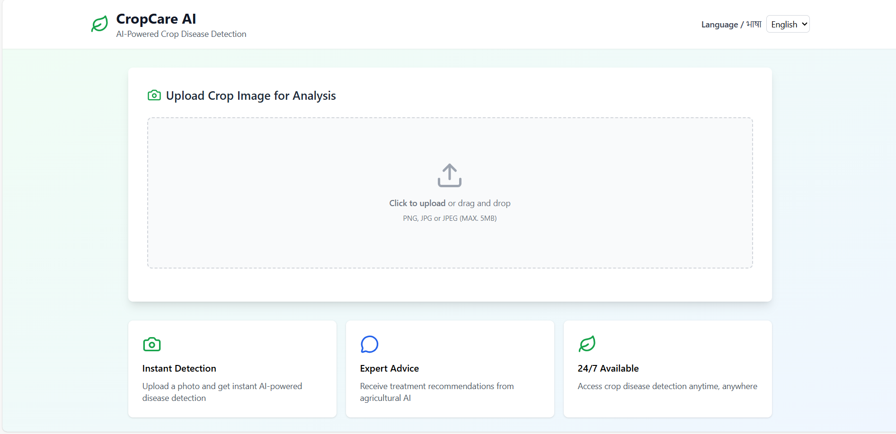
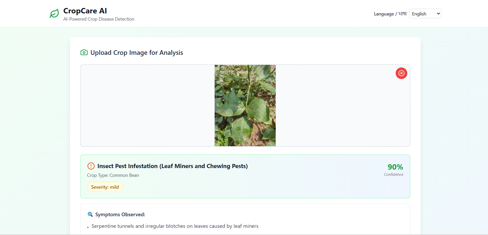
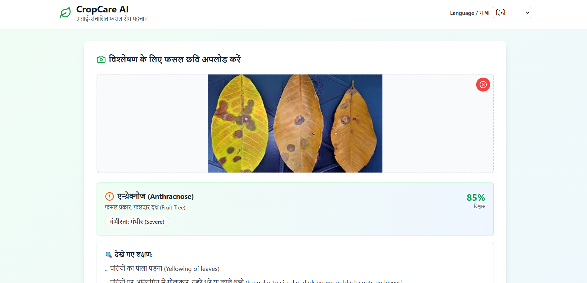
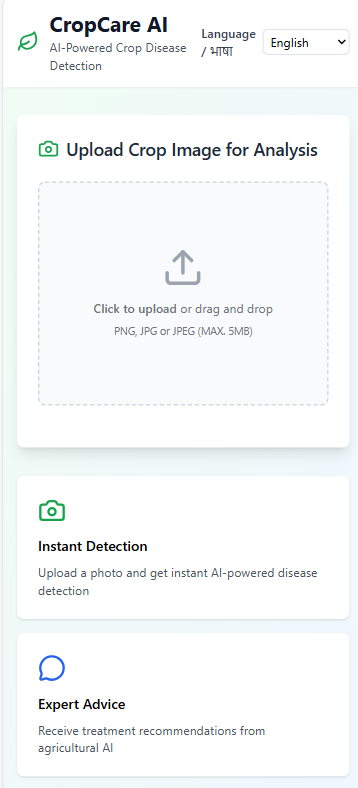

# CropCare AI – Frontend  
**AI-Powered Crop Disease Detection for Indian Farmers**

[](https://skillsbuild.org/)  
[](https://react.dev/)  
[](https://vitejs.dev/)  
[](https://tailwindcss.com/)  
[](https://vercel.com/)

**Live Demo**: https://cropcare-ai-frontend.vercel.app/
**Backend Repo**: https://github.com/Eldorado-369/cropcare-ai-backend  

Submitted as part of **IBM SkillsBuild AI-ML Internship** by **Eldho K Shajee**

### Project Overview
CropCare AI is a mobile-friendly web application that lets Indian farmers upload a crop leaf/plant photo and get instant AI-powered disease diagnosis — including name, severity, symptoms, treatments, and prevention tips — in their preferred Indian language.

Frontend built with React + Vite, styled with Tailwind CSS, and deployed on Vercel for fast, global access.

### Key Features
- Image upload with preview and drag-and-drop
- Language selector (English + 9 Indian languages: Hindi, Tamil, Telugu, Kannada, Malayalam, Bengali, Marathi, Gujarati, Punjabi)
- Real-time API call to backend for Gemini AI analysis
- Beautiful result display: crop type, disease, confidence, severity (Mild/Moderate/Severe), symptoms, treatment, prevention
- Loading spinner, error handling, responsive mobile-first design
- No login required – fully accessible on low-end smartphones

### Tech Stack (Frontend)
- React.js + Vite (fast dev & build)
- Tailwind CSS (styling)
- Lucide React (icons)
- Axios (API requests)
- Environment variables for backend URL (`VITE_API_URL`)

### Screenshots

  
  
  



### Quick Start (Local)
```bash
git clone https://github.com/Eldorado-369/cropcare-ai-frontend.git
cd cropcare-ai-frontend
npm install
npm run dev